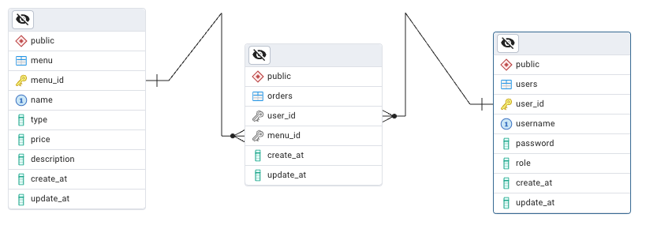

# Bistro Management App

## Project Overview

The Bistro Management Application is a robust software solution tailored to efficiently manage various aspects of a bistro, including food items, orders, reservations, dining tables, and user roles. The application employs role-based access control, ensuring that user actions are aligned with their roles—customers and staff members have distinct permissions. With the implementation of JSON Web Tokens (JWT) for authentication, the app secures sensitive operations, allowing customers to place orders and make reservations while enabling staff to manage data pertinent to their responsibilities.

## Technology Stack

- **Frontend:**
  - **ReactJS** - For building a dynamic and interactive user interface.

- **Backend:**
  - **Spring**
  - **JWT (JSON Web Tokens)** - For securing endpoints and managing user sessions.

## Database Design

The application's database is designed to reflect the different entities and their relationships. Here's the ERD representing the structure:

## User Stories and API Endpoints

### User Authentication

- **Customer Login**

  **User Story:**
  - **As a** customer,
  - **I want** to log in to the application,
  - **So that** I can access and manage my orders and reservations.

  **API Endpoint:**
  - `POST /login`: Authenticates the customer and provides a JWT.

- **Staff Login**

  **User Story:**
  - **As a** staff member,
  - **I want** to log in to the application,
  - **So that** I can access and manage orders, and update menu items.

  **API Endpoint:**
  - `POST /login`: Authenticates the staff member and provides a JWT.

### Customer Operations

- **View Menu**

  **User Story:**
  - **As a** user,
  - **I want** to view the menu,
  - **So that** I can see the available dishes and make informed choices.

  **API Endpoint:**
  - `GET /menu`: Retrieves all menu items.

- **Order from Menu**

  **User Story:**
  - **As a** user,
  - **I want** to order from the menu,
  - **So that** I can enjoy my selected dishes.

  **API Endpoint:**
  - `POST /orders`: Places a new order.

- **Edit My Order**

  **User Story:**
  - **As a** user,
  - **I want** to edit my order,
  - **So that** I can make changes before it is prepared.

  **API Endpoint:**
  - `PUT /orders/{id}`: Updates an existing order.

- **Reserve/Cancel a Table**

  **User Story:**
  - **As a** user,
  - **I want** to reserve or cancel a table,
  - **So that** I can ensure a table is available when I arrive or cancel if my plans change.

  **API Endpoints:**
  - `POST /reservations`: Makes a new reservation.
  - `DELETE /reservations/{id}`: Cancels a reservation.

### Administrator (Staff) Controls

- **View Orders**

  **User Story:**
  - **As an** administrator,
  - **I want** to view all orders,
  - **So that** I can oversee the order process and ensure everything is running smoothly.

  **API Endpoint:**
  - `GET /orders`: Retrieves all current orders.

- **Add or Edit Menu Item**

  **User Story:**
  - **As an** administrator,
  - **I want** to add or edit a menu food item,
  - **So that** I can keep the menu up-to-date with new dishes or changes to existing ones.

  **API Endpoints:**
  - `POST /menu`: Adds a new food item to the menu.
  - `PUT /menu/{id}`: Updates an existing food item on the menu.

- **Cancel or Delete Orders**

  **User Story:**
  - **As an** administrator,
  - **I want** to cancel or delete orders,
  - **So that** I can manage order changes and handle issues.

  **API Endpoint:**
  - `DELETE /orders/{id}`: Cancels or deletes an order.

- **Change Order Status**

  **User Story:**
  - **As an** administrator,
  - **I want** to change the status of orders to settled or unsettled,
  - **So that** I can track which orders have been paid for and which are still outstanding.

  **API Endpoint:**
  - `PUT /orders/{id}/status`: Updates the status of an order to settled or unsettled.

## Backend Setup

*Details on setting up the backend will be provided here.*

## Frontend Setup

*Details on setting up the frontend will be provided here.*

## Routes

### Customer Routes

*Details on customer-specific routes will be added here.*

### Staff Routes

*Details on staff-specific routes will be added here.*

## Testing

*Details on testing strategies, tools, and coverage will be provided here.*
